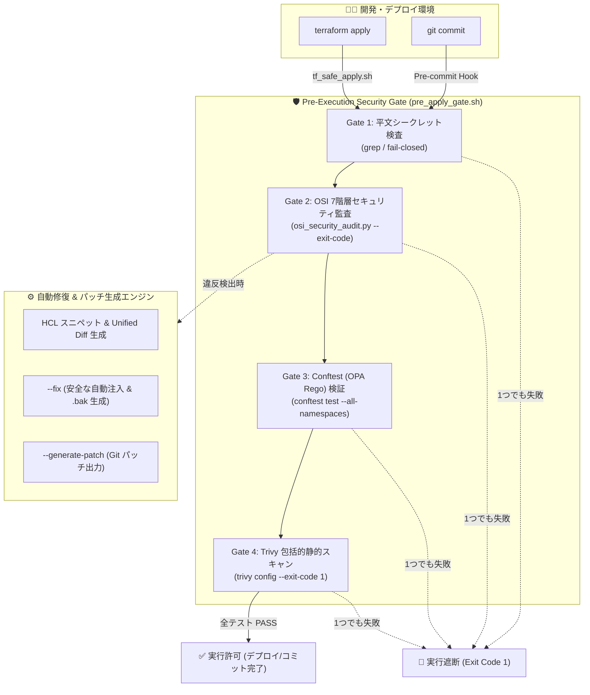

## はじめに

Terraformをはじめとする Infrastructure as Code (IaC) の普及に伴い、インフラのセキュリティチェックツール（Trivy, tfsec, Checkov など）の導入は一般的になりました。
しかし、現場で運用していると以下のような課題に直面することが少なくありません。

1. **「どこにどんなレイヤの脆弱性があるのか」の体系的な把握が難しい**
   - 単発のルール違反（例: `storage_encrypted is false`）が羅列されるだけで、ネットワーク境界・トランスポート・セッション・アプリ層のどこが手薄なのか全体像が見えにくい。
2. **「で、どう修正すればいいの？」の負担**
   - 警告文は出るものの、実際の HCL コードの追記スニペットや差分（Unified Diff）を手作業で書く必要があり、修正コストが高い。
3. **CI/デプロイ前に確実にブロックする仕組み（Fail-Closed）の不足**
   - 警告だけでコミットや `terraform apply` が通ってしまい、本番環境に設定不備が流出してしまう。

そこで今回、古典的かつ最も堅牢なネットワーク設計の基礎である **「OSI参照モデル（L1〜L7）」** の概念を Terraform 監査にマッピングし、さらに **Conftest (Open Policy Agent) によるデプロイ前遮断ゲート** と **ワンコマンド自動修復 (`--fix`)** を備えたセキュリティツールキットを実装しました。

本記事では、その設計思想から実装の詳細、実際の検証シナリオまでを一挙に解説します。

---

## 1. なぜ「OSI参照モデル」をクラウドセキュリティに適用するのか？

クラウド（AWS）のインフラであっても、防御の本質は **多層防御（Defense in Depth）** です。OSI 7階層モデルに当てはめて監査観点を整理することで、「どのレイヤの防御が欠落しているか」を一目瞭然にできます。

| レイヤ | 分類 | AWS における対象リソース | 監査観点・防御目的 |
| :--- | :--- | :--- | :--- |
| **L1** | **物理層** | `provider "aws"`, `aws_subnet` | 東京リージョン (`ap-northeast-1`) 制限、Multi-AZ 物理冗長化 |
| **L2** | **データリンク層** | `aws_vpc` | 専用 VPC によるハイパーバイザー境界分離（MAC/ARP スプーフィング遮断） |
| **L3** | **ネットワーク層** | `aws_subnet`, `aws_route_table`, `aws_network_acl`, `aws_flow_log` | Public/Private サブネット分離、ステートレス NACL 境界防御、VPC Flow Logs 追跡 |
| **L4** | **トランスポート層** | `aws_security_group`, `aws_vpc_security_group_rule` | SSH(22)/RDP(3389) 非公開、DB ポートの SG チェイニング、Egress 最小権限化 |
| **L5** | **セッション層** | `aws_lb_listener` | ALB HTTPS (443) 強制、HTTP (80) からの 301 リダイレクト、TLS 1.2/1.3 暗号スイート |
| **L6** | **プレゼンテーション層** | `aws_rds_cluster_parameter_group`, KMS, EBS | RDS 通信の SSL 強制 (`require_secure_transport=ON`)、EBS/RDS/S3 の CMK 保存時暗号化 |
| **L7** | **アプリケーション層** | `aws_wafv2_web_acl`, `aws_lb`, `aws_instance`, `aws_ecs_task_definition` | AWS WAFv2 アタッチ (SQLi/XSS 防御)、不正 HTTP ヘッダードロップ、IMDSv2 強制 (SSRF対策)、コンテナの読み取り専用FS |

このように分類することで、「ネットワーク層（L3）のサブネット分離はできているが、アプリ層（L7）の WAF が抜けている」といった防御の偏りを即座に特定できます。

---

## 2. 構築したシステムの全体アーキテクチャ

システム全体は以下のコンポーネントで構成されています。



### 主要ファイル構成
- **`scripts/osi_security_audit.py`**: OSI 7階層監査、Mermaid トポロジー図生成、自動修正エンジン（Python標準ライブラリのみで動作）
- **`scripts/osi_rules.yaml`**: 外部化されたルール定義・重要度・例外抑止設定
- **`scripts/pre_apply_gate.sh`**: 4段階のチェックを直列実行するデプロイ前遮断ゲート
- **`scripts/tf_safe_apply.sh`**: Terraform Plan 生成後にゲートを検証し、全クリア時のみ Apply するラッパー
- **`scripts/install_hooks.sh`**: Git Pre-commit Hook インストーラー
- **`tests/test_osi_security_audit.py`**: pytest による12件の単体・回帰テストスイート

---

## 3. コア機能の設計と実装

### ① 静的コード解析と具体的な修正コード (HCL Snippet / Diff) の自動提示

従来の監査ツールでは「ALB に WAF を関連付けてください」といったテキストしか出ないケースが多いですが、本ツールでは `Finding` データクラスに **具体的な推奨 HCL スニペット** と **Unified Diff** を組み込みました。

```python
@dataclass
class Finding:
    layer: int
    layer_name: str
    check_id: str
    severity: str  # "CRITICAL", "HIGH", "MEDIUM", "LOW", "PASS"
    title: str
    resource: str
    file_path: str
    description: str
    recommendation: str
    code_remediation: Optional[str] = None  # 推奨 HCL コード
    diff_patch: Optional[str] = None        # Unified Diff
```

実行すると、ターミナル上にカラー付きの推奨修正コードが表示されます：

```bash
$ python3 scripts/osi_security_audit.py --show-diff

▶ L7 アプリケーション層 (Application Layer)
  [HIGH] ALB / CloudFront への AWS WAFv2 未紐付け (L7-WAF-PROTECTION)
     対象: aws_lb, aws_cloudfront_distribution (aws/modules/elb/aws_elb.tf)
     説明: パブリック ALB または CloudFront に WAF Web ACL が関連付けられていません。
     推奨改善案: `aws_wafv2_web_acl` および `aws_wafv2_web_acl_association` を定義してアタッチしてください。
     --- 推奨修正コード (Terraform Snippet) ---
       # --- L7 Remediation: AWS WAFv2 Association ---
       resource "aws_wafv2_web_acl" "alb_waf" {
         name        = "${var.env}-${var.service}-alb-waf"
         scope       = "REGIONAL"
         ...
       }
       resource "aws_wafv2_web_acl_association" "alb_waf_assoc" {
         resource_arn = aws_lb.app-lb.arn
         web_acl_arn  = aws_wafv2_web_acl.alb_waf.arn
       }
```

さらに、セキュリティグループ間のトラフィック（Ingress/Egress）を自動解析し、Mermaid 形式のトポロジー図も同時に生成されます。

### ② 自動修正モード (`--fix`) とパッチファイル出力 (`--generate-patch`)

開発者がコードを手書きしなくてもワンコマンドで解決できるよう、`RemediationManager` を実装しました。

- **事前シミュレーション (Dry-run)**:
  ```bash
  $ python3 scripts/osi_security_audit.py --fix --dry-run
  === Auto-Remediation Execution Results [DRY-RUN] ===
  ✓ Modified: aws/modules/network/vpc.tf (Rules applied: L3-SUBNET-SEGREGATION, L3-NETWORK-ACL)
  ✓ Modified: aws/modules/elb/aws_elb.tf (Rules applied: L7-WAF-PROTECTION)
  ```
- **パッチ生成**:
  ```bash
  $ python3 scripts/osi_security_audit.py --generate-patch osi.patch
  # => git apply osi.patch でレビュー後に適用可能
  ```
- **自動修正の適用**:
  ```bash
  $ python3 scripts/osi_security_audit.py --fix
  # => 対象ファイルに安全にコードが注入され、元のファイルは .bak としてバックアップ
  ```

### ③ ルール定義と例外抑止の外部化 (`osi_rules.yaml`)

チームや環境（開発環境・本番環境）に応じてルールを柔軟に変更できるよう、YAML でルール設定を外部化しました。

```yaml
settings:
  fail_on_severity: ["CRITICAL", "HIGH"]
  allowed_regions: ["ap-northeast-1"]
  dangerous_ports: ["22", "3389"]

# 例外抑止 (Suppression)
suppressions:
  - check_id: "L3-NETWORK-ACL"
    resource: "aws_network_acl.external_appliance"
    reason: "外部セキュリティアプライアンスで管理されているため除外"

rules:
  L1-MULTI-AZ:
    enabled: true
    severity: LOW  # 検証環境用に Severity を緩和
```

`copy.deepcopy` を用いて設定インスタンスを管理することで、テスト実行時や並行実行時のイミュータビリティを担保しています。

### ④ Conftest (OPA) × OSI 監査によるデプロイ前遮断ゲート (`pre_apply_gate.sh`)

本ツールの最大の要となるのが **「実行前に問題があるものは絶対にデプロイさせない」** という Fail-Closed（安全側に倒す）のゲート設計です。

```bash
#!/bin/bash
set -euo pipefail

# 1. 平文シークレット検査 (grep)
# 2. OSI 参照モデル監査 (osi_security_audit.py --exit-code)
# 3. Conftest OPA ポリシー検査 (conftest test --all-namespaces --policy policy/)
# 4. Trivy 設定ミススキャン (trivy config --exit-code 1)
```

:::message alert
**Conftest (OPA) と Trivy の Rego バージョン互換性について**
最新の Conftest (OPA 1.0+) は Rego v1 (`deny contains msg if { ... }`) をデフォルトとしますが、既存の Trivy は Rego v0 (`deny[msg] { ... }`) をパースします。
本構成では `conftest test --rego-version v0` を指定することで、単一の `policy/*.rego` を Conftest と Trivy の双方で共用できるように設計しています。
:::

### ⑤ 安全な Terraform デプロイラッパー (`tf_safe_apply.sh`)

日常的なデプロイ作業で確実にゲートを通すため、`terraform apply` の安全ラッパーを用意しました。

```bash
$ ./scripts/tf_safe_apply.sh aws/stacks/network
```
1. `terraform plan -out=tfplan` を実行
2. `terraform show -json tfplan > tfplan.json` でプランを JSON 化
3. `pre_apply_gate.sh` にプランを渡して OPA/OSI 監査を実行
4. **1件でもポリシー違反があれば、プランを破棄してデプロイを即時中止**
5. すべてクリアした場合のみ `terraform apply tfplan` を実行

---

## 4. 実際の動作検証

### シナリオA: セキュリティ不備によるデプロイ遮断

未修正の状態でゲートを実行すると、高重要度（HIGH）の脆弱性が検知され、Exit Code 1 で処理がブロックされます。

```bash
$ ./scripts/pre_apply_gate.sh

▶ L3 ネットワーク層 (Network Layer)
  [HIGH] パブリック / プライベートサブネットの未分離 (L3-SUBNET-SEGREGATION)
▶ L7 アプリケーション層 (Application Layer)
  [HIGH] ALB / CloudFront への AWS WAFv2 未紐付け (L7-WAF-PROTECTION)

==============================================================================
  🛑 [GATE BLOCKED] Security violations detected! Execution is PROHIBITED.
==============================================================================
Execution was blocked due to the following failure(s):
  - OSI 7-Layer security audit reported CRITICAL/HIGH violations
```

### シナリオB: ワンコマンド自動修復とゲート通過

`--fix` を実行後、再度ゲートを実行します。

```bash
$ python3 scripts/osi_security_audit.py --fix
=== Auto-Remediation Execution Results ===
✓ Modified: aws/modules/network/vpc.tf (Rules applied: L3-SUBNET-SEGREGATION, L3-NETWORK-ACL)
✓ Modified: aws/modules/elb/aws_elb.tf (Rules applied: L7-WAF-PROTECTION)

$ ./scripts/pre_apply_gate.sh
==============================================================================
  ✅ [GATE PASSED] All security requirements met! Execution is permitted.
==============================================================================
```

### シナリオC: Conftest (OPA) による不正プランの検知

S3 バケットに `acl = "public-read"` を付与した不正なプランを投入した例：

```bash
$ ./scripts/pre_apply_gate.sh test_violation_plan.json

[Gate 3/4] Running Conftest OPA Policy Verification...
FAIL - test_violation_plan.json - terraform.deny - S3 bucket 'public_bucket' has public-read ACL. This is prohibited.

==============================================================================
  🛑 [GATE BLOCKED] Security violations detected! Execution is PROHIBITED.
==============================================================================
```
OPA ポリシーエンジンが静的プランを即座にブロックし、意図しないパブリック公開を水際で防御できました。

---

## 5. Agentic Workflow（AIエージェント）との親和性

本プロジェクトでは、Antigravity / Gemini CLI の **Workspace Skills** 機構を活用し、`.agents/skills/osi-security-audit/SKILL.md` としてスキル定義を配置しています。

AI アシスタントに対して：
> 「OSI 監査を実行して、修正が必要な部分を教えて」
> 「セキュリティゲートをパスするように修正を適用してコミットして」

と指示するだけで、エージェントが自律的に `pre_apply_gate.sh` や `--fix`、テストスイートを呼び出し、安全なインフラコードの改修を完結させることが可能になりました。

---

## おわりに

本取り組みを通じて、以下の価値を実現できました：

- **OSI 参照モデルという普遍的なメンタルモデル** による、インフラセキュリティの直感的な可視化
- **「指摘」にとどまらない、具体的な修正コード提示と自動修復（`--fix`）** による開発者体験の向上
- **Conftest (OPA) を組み込んだ多段セキュリティゲート** による、デプロイ前の確実な事故防止（Shift-Left & Fail-Closed）

Terraform の静的解析やセキュリティガバナンスで「ルールが形骸化している」「修正が追いつかない」とお悩みの方は、ぜひ OSI 参照モデルと OPA を組み合わせたアプローチを試してみてください！
